# The Ministry of Herbology

A self-hosted, mobile-first web app for keeping an inventory of your indoor and
outdoor plants and actually tending them. It schedules watering around the
weather, warns you before a frost, maps where every plant stands, keeps an
illustrated journal, and connects to Home Assistant and your calendar. All of
it is dressed as an old botanical institution's ledger.

> **Status: beta, working towards v1.0.** Every screen exists and the app runs
> from the demo and from the [deployment guide](docs/deploy/README.md). Read
> [Known limitations](#known-limitations) before installing it for real.

<p align="center">
  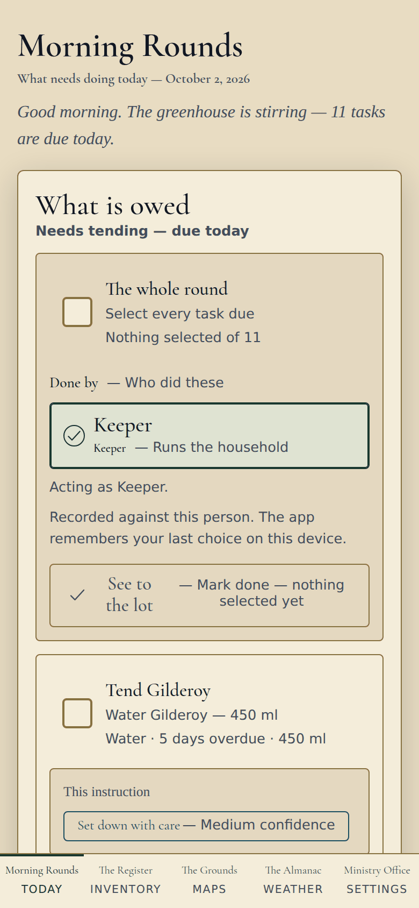
  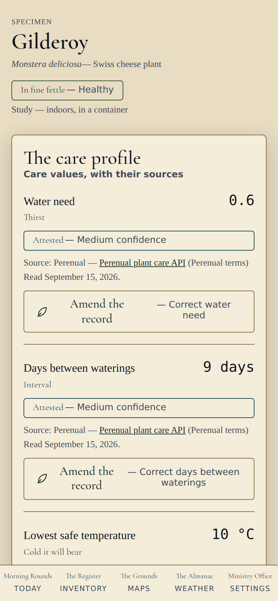
  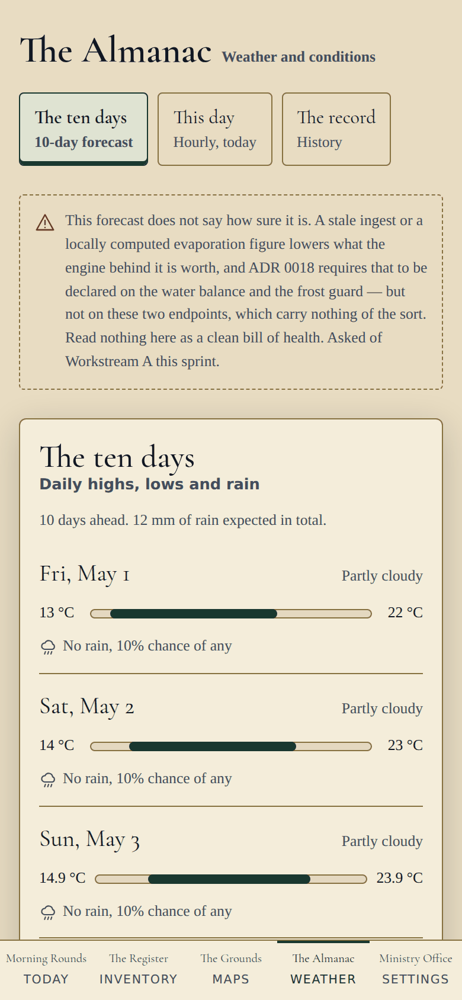
</p>

## Contents

- [What it does](#what-it-does)
- [Screenshots](#screenshots)
- [Status](#status)
  - [Known limitations](#known-limitations)
- [Getting started](#getting-started)
  - [1. Try the demo](#1-try-the-demo-about-10-minutes)
  - [2. Install it for your own garden](#2-install-it-for-your-own-garden)
  - [3. First-time setup](#3-first-time-setup)
  - [4. Optional: Home Assistant, notifications and calendar push](#4-optional-home-assistant-notifications-and-calendar-push)
  - [5. Updates and backups](#5-updates-and-backups)
- [Reporting problems](#reporting-problems)
- [Principles](#principles)
- [Stack and development](#stack-and-development)
- [Documentation](#documentation)

## What it does

The app has five sections, plus a page for each plant and an illustrated
journal. Each section has a themed name and a plain one, and the plain name is
always shown beside it.

| Section | Plain name | What you do there |
| --- | --- | --- |
| **Morning Rounds** | Today | See what needs doing today, overdue first. Tick tasks off one at a time or a whole round at once, and record who did them. Waterings the rain already covered stay on the list, marked "Sated by the heavens — rain covered it", rather than vanishing. |
| **The Register** | Inventory | Search and filter every plant by name, place, health and pet toxicity. **Add a plant** by typing a name: the app looks it up in botanical sources (POWO, GBIF), you pick the match, and it's in. |
| **The Grounds** | Maps | Upload a floor plan or a property survey, calibrate it to real distances, draw zones and pin each plant. Tapping a pin opens that plant. |
| **The Almanac** | Weather | A ten-day forecast, hourly for today, and history charts (1, 7 and 30 days) for outdoor weather and indoor rooms. Frost warnings look 72 hours ahead, per species, including US National Weather Service advisories. |
| **Ministry Office** | Settings | Integration health, locations, household members, private calendar feeds, calendar push status and backups. |

Each plant has four pages ("facets"):

- **Register Entry** — where it stands, its pot and soil, where it came from,
  its photographs and its growth log.
- **Tending** — its care values, each with a source and a confidence level that
  you can amend, its care schedule, and its water balance.
- **Compendium** — what is known about the species: summary, taxonomy, native
  range and toxicity, each cited.
- **Journal** — its botanical plate, the household's field notes and its photos.

**The Naturalist's Journal** pages through the household like a book, with one
illustrated plate per plant. Plates come from public-domain botanical
collections first. A plate can be generated only if the operator sets that up,
and a generated plate is always labelled as such. A keeper accepts each plate
by name. A plant with no plate says why, instead of borrowing another plant's
picture.

Behind the screens:

- **Smart watering.** A daily soil water balance (rain minus evaporation) for
  outdoor plants decides when they need watering.
- **Frost guard.** Raises "bring indoors" and "return outdoors" tasks, and asks
  where the plant went when you complete one.
- **Calendar.** A private calendar feed per person, which you can filter.
  Optional instant push to a CalDAV calendar (iCloud, Fastmail, Nextcloud).
- **Home Assistant.** Indoor temperature and humidity readings, phone
  notifications, and a summary feed for an e-ink display (the Lunette).
- **Works offline.** Care pages work with no signal, and the app installs to
  your home screen.
- **Accessibility.** Checked against WCAG AA on every screen, in both themes,
  in CI.

## Screenshots

These were taken on 2 October 2026 from the running app in **demo mode**, so
the household, the plants and the weather are built-in sample data. In demo
mode the photographs and plates are deliberately schematic stand-ins, not real
pictures.

The visual design is getting one more pass before v1.0. That
pass self-hosts the body and interface typefaces and adds the style guide's
borders and ornament, so expect the finished app to look more like an old
ledger than these images do.

| Morning Rounds (night greenhouse theme) | Morning Rounds (desktop) |
| :---: | :---: |
| 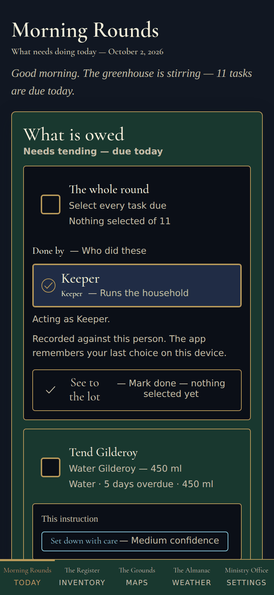 | 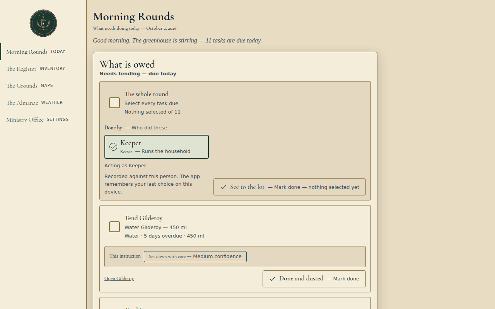 |

| The Register | A plant: Register Entry | A plant: Compendium |
| :---: | :---: | :---: |
| 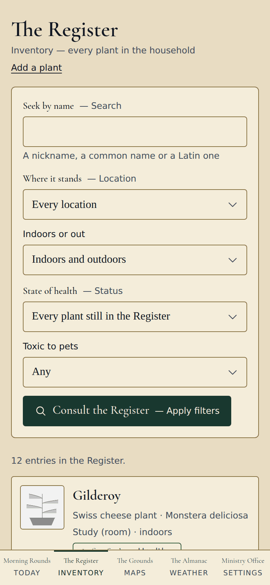 | 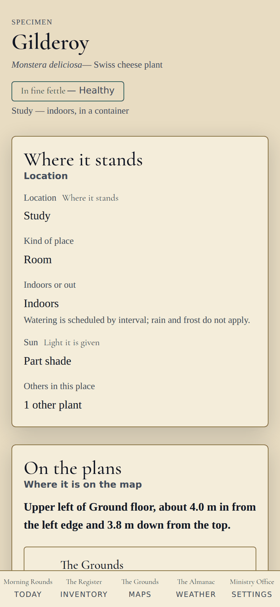 | 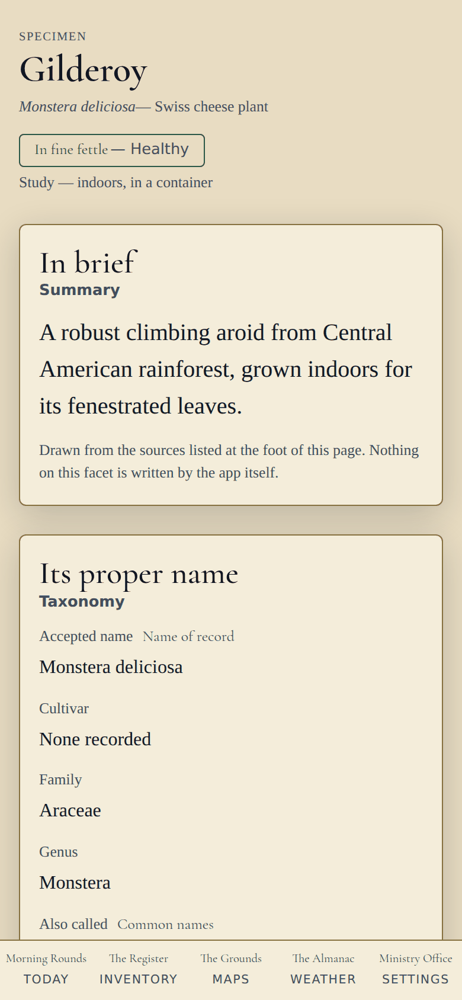 |

| The Grounds | The Almanac: today | The Almanac: history |
| :---: | :---: | :---: |
| 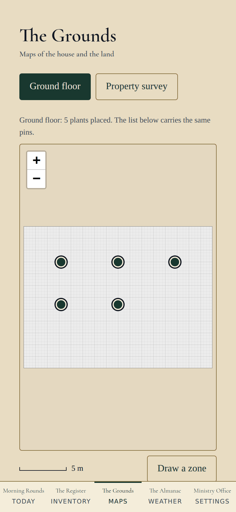 | 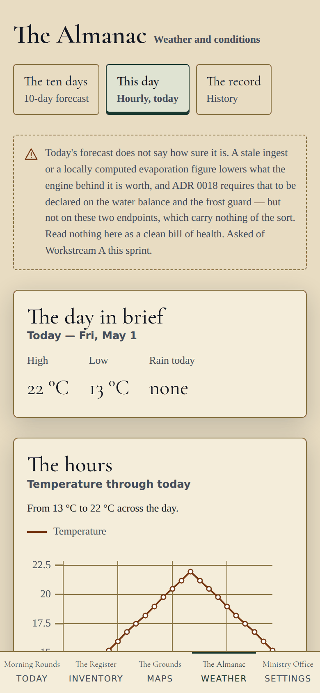 | 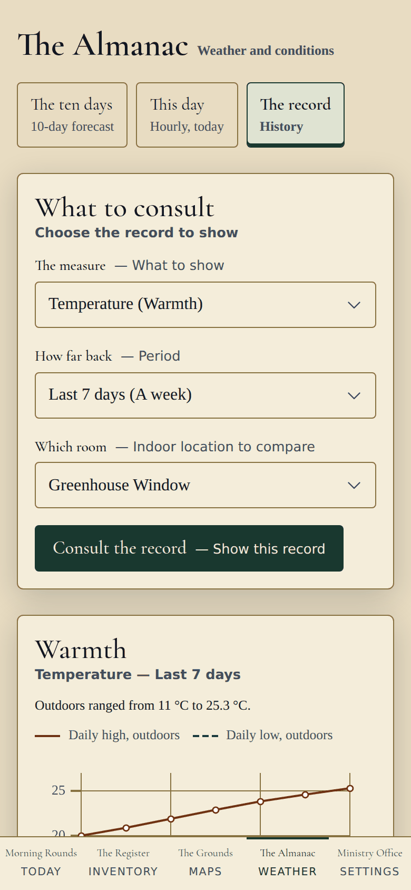 |

| The Naturalist's Journal | Ministry Office |
| :---: | :---: |
| 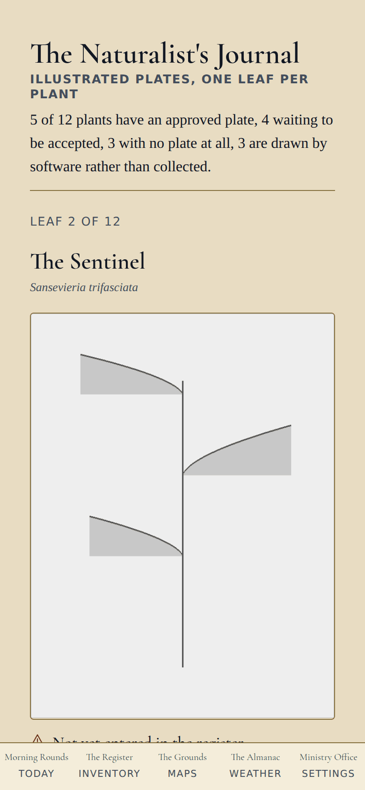 | 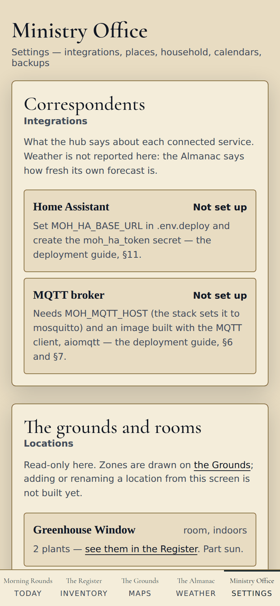 |

Also in the folder:
[the Grounds on a desktop](docs/screenshots/grounds-desktop.png) and
[the Journal in the dark theme](docs/screenshots/journal-dark.png).

## Status

### Known limitations

Read these before installing for real:

1. **There is no login yet.** Anyone who can reach the address can see and
   change everything. The shared sign-in is planned for future builds.
   Even with it, keep the app on your home network or behind a VPN such
   as WireGuard or Tailscale, and **do not expose it to the internet.** The
   sign-in is a lock on the door, not a reason to put the door on the street.
3. **A new plant starts with no care values in a real installation.** The
   botany worker looks up cited care values, but nothing saves them to your
   database yet. In demo mode the sample plants come with theirs. This is fixed
   for v1.0.
   Until then, give each new plant a watering interval yourself (a *care rule*,
   [§3](#3-first-time-setup)). Until you do, it sits under "Nothing is
   scheduled for these" in Morning Rounds, so it isn't forgotten.
4. **Some setup is still done outside the app.** You enter your site (its
   location and timezone) and your household members with one database
   command. Locations and care rules go in through the API's built-in page.
   Plants, calendar feeds and everything day-to-day are done in the app.
5. **Home Assistant and CalDAV push** were written against their documentation
   and tested against stand-ins, not yet against a real hub or iCloud account.
   Please report how it goes.
6. **A plant added in the app shows its first watering as overdue.** The Add
   a plant form doesn't ask for the date you got the plant, and without one
   the schedule counts from 1 January 2024. Tick that first watering once and
   the cycle restarts from that day. Or set `acquired_on` with
   `PATCH /specimens/{id}` in the API docs page. This is fixed for v1.0.
7. **There is no theme switch on the screens yet.** The app opens in the light
   parchment theme. The dark night-greenhouse theme is built and checked, but
   the control for it is only on the component gallery (`/gallery`) for now.
   The choice made there is remembered across the app. Light, Dark and Auto
   on every screen arrive for v1.0.
8. **One machine.** The deployment has been run on a single-node swarm. A
   multi-node swarm hasn't been tried.

## Getting started

There are two ways in:

- **Try the demo** to look around with sample data, in about ten minutes.
- **Install it for your own garden** when you want to track your real plants.

### 1. Try the demo (about 10 minutes)

The demo runs entirely on your computer with a built-in fictional household:
twelve plants, seven locations and thirty days of recorded weather. It needs no
accounts, no keys and no internet after the first download. Anything you change
is kept in memory and lost when you stop it.

**You need:** `git`, `make`, and Docker with Compose v2 (Docker Desktop on Mac
or Windows, or Docker Engine 24+ on Linux).

```sh
git clone https://github.com/mtaylor45/Ministry-of-Herbology-V1.0.0.git
cd Ministry-of-Herbology-V1.0.0
make dev
```

The first run downloads and builds the images. When it finishes:

- **The app:** <http://localhost:5173>. On your phone, use your computer's LAN
  address instead of `localhost`.
- **The API and its interactive docs:** <http://localhost:8000/api/v1/docs>

**Things to try:**

- Tick two tasks in Morning Rounds and press *Mark done*.
- Open a plant and compare its Tending and Compendium pages.
- Page through the Journal with the arrow keys.
- Tap a pin on the Grounds.
- See the night-greenhouse theme at <http://localhost:5173/gallery>, the
  component gallery. The in-app switch for it is still to come: see
  [Known limitations](#known-limitations).

`make down` stops everything.

<details>
<summary><strong>Without Docker</strong> (Python 3.11 and Node 22)</summary>

```sh
git clone https://github.com/mtaylor45/Ministry-of-Herbology-V1.0.0.git
cd Ministry-of-Herbology-V1.0.0
python3.11 -m venv .venv
.venv/bin/pip install -e 'api[dev]'

# Terminal 1 — the API, serving the sample household
PYTHONPATH=api:. MOH_MOCK_MODE=true .venv/bin/uvicorn app.main:app --port 8000

# Terminal 2 — the web app
cd web
npm ci
npm run dev
```

Then open <http://localhost:5173>. The screenshots above were taken this way,
from a production build (`npm run build`).

</details>

### 2. Install it for your own garden

A real installation runs as a Docker swarm stack: the database, the API, the
web app, the background workers, an MQTT broker, and Nginx for HTTPS. **One
Linux machine is enough.** A small home server or NAS that can run Docker works
well. The full walkthrough, with a troubleshooting section, is the
**[deployment guide](docs/deploy/README.md)**. This is the short version.

**You need:**

- a Linux machine with Docker Engine 24 or newer, plus `git`, `make` and
  `openssl`;
- a hostname for it on your network (e.g. `herbology.home.arpa`) and a TLS
  certificate for that name. A self-signed certificate is fine on a home network
  ([guide §5](docs/deploy/README.md#5-certificates));
- an email address, because the US National Weather Service requires a contact
  for its data.

**Steps**, on that machine:

```sh
# 1. Get the code. Keep this folder: upgrades and backups run from it.
git clone https://github.com/mtaylor45/Ministry-of-Herbology-V1.0.0.git
cd Ministry-of-Herbology-V1.0.0

# 2. Build the three images. On one machine no registry is needed.
make images MOH_REGISTRY=local/moh        # prints the tag it built

# 3. Turn on swarm mode.
docker swarm init

# 4. Create the six secrets: the database password, the two MQTT secrets, the
#    Home Assistant token (may be blank), and the TLS certificate and key.
#    Every command is in guide §6. You generate each value yourself; none is
#    written in this repository.

# 5. Write .env.deploy with the four required values.
cat > .env.deploy <<'EOF'
MOH_REGISTRY=local/moh
MOH_IMAGE_TAG=<the tag step 2 printed>
MOH_PUBLIC_BASE_URL=https://herbology.home.arpa
MOH_NWS_USER_AGENT=ministry-of-herbology (you@example.net)
EOF

# 6. Deploy. With no registry, tell swarm not to look one up.
make stack-deploy MOH_RESOLVE_IMAGE=never
make stack-ps                              # wait until every service reads Running

# 7. Create the database tables (safe to run again).
make migrate
```

Check that it's up. `-k` accepts a self-signed certificate.

```sh
curl -sk https://localhost/api/v1/healthz
# {"status":"ok","contract_version":"1.10.0","mode":"live","scenario":null}
```

`"mode":"live"` means you're on your own database. **Don't load the sample data
(`make fixtures`) into an installation you plan to keep.** Separating the
fictional household from your own plants later is painful
([guide §10](docs/deploy/README.md#10-fixtures-and-why-you-probably-do-not-want-them)).

Then open `https://<your hostname>` on your phone and use *Add to Home Screen*
to install it as an app.

### 3. First-time setup

**a. Your site and household.** There is one database command to run, on the
machine hosting the database:

```sh
docker exec -it $(docker ps -qf label=com.docker.swarm.service.name=moh_db) \
  psql -U herbology -d herbology
```

Then paste, with your own values:

```sql
-- Your garden. The weather comes from these coordinates, and the timezone
-- decides when "today" starts. nws_zone is for US frost advisories only: leave
-- it NULL elsewhere, or look yours up at https://alerts.weather.gov.
INSERT INTO site (id, name, latitude, longitude, timezone, nws_zone)
VALUES (gen_random_uuid(), 'Home', 39.7684, -86.1581,
        'America/Indiana/Indianapolis', 'INZ047');

-- Everyone who tends the plants. Role: keeper, tender or observer.
INSERT INTO member (id, name, role) VALUES
  (gen_random_uuid(), 'Alex', 'keeper'),
  (gen_random_uuid(), 'Sam',  'tender');

SELECT id FROM site;    -- you'll need this id next
```

`\q` quits.

**b. Places for your plants.** Open **`https://<your hostname>/api/v1/docs`**,
find `POST /locations`, choose *Try it out*, paste the body below and press
*Execute*.

- `kind` is one of `area`, `zone`, `bed`, `room` or `shelf`.
- Outdoor spots can also set `is_covered` (rain doesn't reach) and
  `sun_exposure` (`full_sun`, `part_sun`, `part_shade`, `full_shade`).

```json
{ "site_id": "<site id>", "name": "Kitchen windowsill", "kind": "shelf", "is_outdoor": false }
```

**c. Your plants.** In the app, open **The Register → Add a plant**:

1. Type a name, common or Latin.
2. Pick the match the botanical sources offer, or keep your own name if none
   fits.
3. Choose where it stands.

The form doesn't ask when you got the plant yet, so its first watering will
show as overdue. Tick that first watering once and the cycle restarts from that
day ([limitation 5](#known-limitations)).

**d. Its care.** Give each plant a watering interval. In the API docs page, use
`POST /tending/care-rules`:

```json
{ "specimen_id": "<the plant's id, from its page address>", "task_type": "water",
  "strategy": "interval", "base_interval_days": 7, "amount_ml": 250 }
```

The plant's first watering then appears in Morning Rounds. Tick it off when
it's done, and the next one is scheduled from that day.

- Outdoor plants can use the weather-driven strategy instead. The API docs
  list it under `CareRule`.
- Other task types (`fertilize`, `repot` and more) are listed under `TaskType`.

**e. Your calendar.** In the app, go to **Ministry Office → Calendars** and make
a feed for yourself. You can filter it by indoors or outdoors and by task type.

**The link is shown once.** Add it to your calendar straight away:

- **Apple Calendar** (iPhone or Mac): open the `webcal://` link.
- **Google Calendar** (on the web): *Other calendars → + → From URL*, then
  paste the `https://` version. Google refreshes subscribed calendars slowly,
  about every 12 hours or more.

**Treat the link like a password.** If one leaks, revoke it in the Office and
make another. Revoking one feed doesn't touch the others.

### 4. Optional: Home Assistant, notifications and calendar push

Without any of these, the app still works from the weather and your own
records.

- **Home Assistant** is the only route for indoor sensor readings. Create a
  long-lived access token in Home Assistant, store it as the `moh_ha_token`
  secret, set `MOH_HA_BASE_URL` in `.env.deploy`, and point Home Assistant's
  MQTT integration at this machine on port 1883. **Keep port 1883 on your
  LAN.** The steps are in
  [guide §11](docs/deploy/README.md#11-connecting-home-assistant). The Office
  shows whether it's connected.
- **Phone notifications** go to the Home Assistant companion app. Give each
  member their notify service, and optionally the hour their morning rounds
  should arrive and their quiet hours:

  ```sql
  UPDATE member SET notify_prefs = '{
    "home_assistant": { "service": "mobile_app_alexs_iphone",
                        "rounds_hour": 7, "quiet_hours": [22, 7], "frost": true }
  }' WHERE name = 'Alex';
  ```

  Frost alerts are the only ones that break through quiet hours.
- **Calendar push** sends changes to a CalDAV calendar (iCloud, Fastmail,
  Nextcloud, Radicale) within minutes, instead of waiting for the calendar to
  refresh. The credential is a swarm secret that you, the operator, create per
  feed. The app reads it when pushing and never stores, logs or shows it. The
  steps, including iCloud's address, are in the guide's
  [calendar push section](docs/deploy/README.md#calendar-push-to-a-caldav-calendar).
  Google Calendar push isn't supported; use the subscription link instead.

### 5. Updates and backups

**Back up before every update.** From your `Ministry-of-Herbology-V1.0.0` folder:

```sh
make backup          # the database dump and the three picture volumes, into ./backups/
make restore-check   # proves the newest dump restores, in a scratch database
```

Copy `./backups/` somewhere off the machine. A real restore is in
[guide §13](docs/deploy/README.md#13-backup-and-restore).

**To update:**

```sh
git pull
make images MOH_REGISTRY=local/moh     # note the new tag
# set MOH_IMAGE_TAG in .env.deploy to it, then:
make stack-deploy MOH_RESOLVE_IMAGE=never
make migrate
```

Rolling back and rotating secrets are in
[guide §12](docs/deploy/README.md#12-upgrading).

## Reporting problems

Please do! What helps most:

- **What you did, what you expected, and what you saw.** A phone screenshot is
  perfect.
- **Your version**, from `curl -sk https://localhost/api/v1/healthz` and
  `git describe --tags --always`.
- For install problems, the output of `make stack-ps` and
  `docker service logs moh_api` (or whichever service is unhappy).

Open an issue on this repository. **Leave out tokens, passwords and calendar
links.** The app is built never to print them, and your report shouldn't
either.

It's especially useful to hear when the app **was wrong about a plant**, or
when it **sounded surer than it should have**.

## Principles

- **No invented plant facts.** Every care value carries a source citation and a
  confidence level, and you can amend it. A value with no citation is marked
  *unknown*, visibly.
- **Plain language beside the theme.** Every themed label is paired with a
  plain one, for example "Parched — water today".
- **Saying so beats staying silent.** When the app can't work something out,
  such as a stale forecast, a missing plate or an unreachable source, it says
  what and why.
- **Your data stays yours.** There is no hosted service and no third-party
  font or script. Everything lives on your machine, and `make backup` copies
  it.
- **An original theme.** The wizarding-botany look is the project's own, with
  no franchise names, crests or typefaces
  ([style guide](docs/design/style-guide.md),
  the design).

## Stack and development

SvelteKit PWA · FastAPI (Python 3.11) · Postgres 16 + TimescaleDB · Redis + Arq
· Leaflet · uPlot, deployed as a Docker swarm stack behind Nginx. See
the design.

| Command | What it does |
| --- | --- |
| `make dev` | The whole stack locally, on sample data |
| `make test` | What CI runs: ruff, black, mypy, pytest, vitest, contract tests |
| `make fixtures` | Reload the sample household into the dev database |
| `cd web && npm run a11y` | The WCAG AA audit over every screen ([how](web/src/lib/ui/a11y/README.md)) |

## Documentation

- [Deployment guide](docs/deploy/README.md) — install, upgrade, back up, troubleshoot
- [Contracts](contracts/README.md) — schema, OpenAPI, events
- [Style guide](docs/design/style-guide.md)
